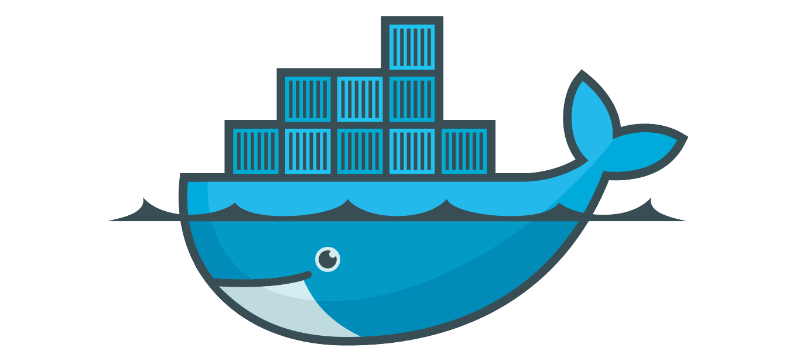
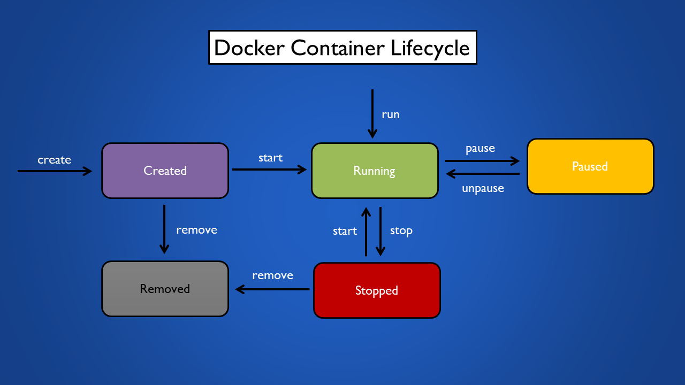

# 💻Docker Fundamentals and Advanced Techniques💻



Welcome to **Docker Fundamentals and Advanced Techniques.** This guide is designed to help you learn Docker, whether you're a beginner or looking to expand your skills.

# Table of Contents

1. [Introduction](#introduction)
2. [Docker Installation](#docker-installation)
    1. [Docker for Ubuntu](#docker-for-ubuntu)
    2. [Docker for Windows](#docker-for-windows)
3. [Basic Docker](#basic-cdecker)
    1. [Docker Command Reference](#docker-command-reference)
    2. [Lifecycle of Docker Conatainer](#lifecycle-of-docker-container)
    3. [Container Naming & Identification](#container-naming-&-identification)
    4. [Container Logs & Stats](#container-logs-and-stats)
    5. [Why a Docker Container exits?](#why-a-docker-container-exits)
    6. [How to Keep the Container Running](#how-to-keep-the-container-running)
    7. [Container Interaction](#container-interaction)
4. [Docker File](#docker-file)
5. [Docker Image](#docker-image)
6. [Advanced Docker](#advanced-commands)
    1. [Docker Networking](#docker-networking)
    2. [Docker Volumes](#docker-volumes)
    3. [Docker Compose](#docker-compose)
    4. [Docker Swarm](#docker-swarm)
    5. [Docker Kubernetes](#docker-kubernetes)
10. [Best Practices](#best-practices)
11. [Troubleshooting](#troubleshooting)
12. [Conclusion](#conclusion)

# Introduction

## What is **Docker?**

Docker is a tool that allows you to create, deploy, and run applications by using containers. 
Using docker you can run your software on different systems and environments like a development environment, a production environment. And, the software will run consistently, regardless of 
what kind of environment it's on.

Docker lets you package and run applications in isolated environments called containers. This isolation allows you to run multiple containers at the same time on a single host. Containers are lightweight and include everything needed to run the application, so they don't depend on the host's setup. You can share containers with others, ensuring they work the same way for everyone.

## What is Docker Good For?

**Easy and Reliable Application Delivery**

Docker helps developers build and share applications smoothly. It keeps everything consistent across different stages of development, making it perfect for continuous integration and delivery.

**Here’s How it Works:**

+ Developers write code and share it using Docker.
+ They test their code in a controlled environment.
+ If they find any issues, they fix them and retest.
+ Once everything works perfectly, they can quickly deploy the application.

## Docker Architecture 


## Quick Terminology Check

**Docker client**
  - The Docker client (docker) is the primary way that many Docker users interact with Docker. When you use commands such as docker run, the client sends these commands to dockerd (daemon), which carries them out. The docker command uses the Docker API. The Docker client can communicate with more than one daemon.

**Docker daemon**
  - The Docker daemon (dockerd) listens for Docker API requests and manages Docker objects
  - It's responsible for managing Docker containers.

**Docker image**
  - A Docker image is like a snapshot of your application. It contains all the files and dependencies needed to run your application. Think of it as a packaged-up version of your software that can be easily transported and run on any machine that has Docker installed. Images are built from a Dockerfile, which contains instructions on how to assemble the image.

**Docker container**
  - A Docker container is like a running instance of your application. It's created from a Docker image and contains everything needed to run your application, including the code, runtime, libraries, and dependencies. Containers are isolated environments, which means they run independently of the host system and other containers. They're lightweight, portable, and can be easily moved between different environments.

**Docker Registries**
  - A Docker registry stores Docker images. Docker Hub is a public registry that anyone can use, and Docker looks for images on Docker Hub by default. You can even run your own private registry.
  - When you use the docker pull or docker run commands, Docker pulls the required images from your configured registry. When you use the docker push command, Docker pushes your image to your configured registry.

# Docker Installation
Simplified installation steps for Docker on Ubuntu and Windows -

### Docker for Ubuntu

**1. Update package repository**

```bash
  $ sudo apt update
```
**2. Install dependencies**

```bash
  $  sudo apt install apt-transport-https ca-certificates curl software-properties-common
```
**3. Add docker GPG key**

```bash
  $ curl -fsSL https://download.docker.com/linux/ubuntu/gpg | sudo apt-key add -
```
**4. Add docker repository**

```bash
  $ sudo add-apt-repository "deb [arch=amd64] https://download.docker.com/linux/ubuntu $(lsb_release -cs) stable"
```
**5. Install docker engine**

```bash
  $ sudo apt update
```
```bash
  $ sudo apt install docker-ce
```
**6. Verify Docker Installation**

```bash
  $ sudo docker --version
```
### Docker for Windows

**1. Download docker desktop installer**
  
  Go to the Docker Desktop for Windows page and download the installer.

**2. Run installer**

  Run the downloaded installer and follow the installation instructions. Docker Desktop will install Docker Engine, Docker CLI client, Docker Compose, Docker Machine, and Docker Kubernetes.

**3. Start docker desktop**

  Once installed, start Docker Desktop from the Start menu.

**4. Verify docker installation**

  Open a command prompt and run
  ```bash
    $ docker --version
  ```

# Basic Docker

These section should help you manage Docker on your system efficiently.

### Docker Command Reference

**Check Installed Docker Version**

```bash
  $ sudo docker version
```
**Display System-wide Information**

```bash
  $ sudo docker info
```
**Check Docker Service Status**

```bash
  $ sudo systemctl status docker
```
**List Currently Running Docker Containers**

```bash
  $ sudo docker ps
```
**List All Docker Containers (including stopped ones)**

```bash
  $ sudo docker ps -a
```
**List Available Docker Images**

```bash
  $ sudo docker images
```
**Correct Command to List Running Containers**

```bash
  $ docker container list
```

### Lifecycle of a Docker container

The lifecycle of a Docker container involves several stages, including creation, running, stopping, and removal. Containers are instantiated from Docker images, operated as isolated instances, and can be halted or paused as necessary. Finally, when their purpose is fulfilled or they are no longer required, containers can be efficiently removed.



**Creates a new container but does not start it**

```bash
  $ docker create --name my-container nginx
```
Creates a new container named "my-container" using the Nginx image but does not start it.

**Docker start**

```bash
  $ docker start my-container
```
Starts the container named "my-container" that was previously created but stopped.

**Docker run**

```bash
  $ docker run --name my-container nginx
```
This command combines the process of creating and starting a container named "my-container" using the Nginx image in a single step.

**Docker pause/unpause**

```bash
  $ docker pause my-container
```
```bash
  $ docker ps --filter "name=my-container"
```

```bash
  $ docker unpause my-container
```
**Docker stop**

```bash
  $ docker stop my-container
```

**Docker remove**

```bash
  $ docker rm my-container
```

**Run a container from an image**

```bash
  $ docker run nginx
```

**Run a command inside a running container**

```bash
  $ docker exec my-nginx ls /usr/share/nginx/html
```
**Display detailed information about a container**

```bash
  $ docker inspect my-container
```
**Stop a running container via name**

```bash
  $ docker stop my-container
```
**Stop all running container**

```bash
  $ docker container stop $(docker container ps -q)
```
**Start a stopped container vi ID.**

```bash
  $ docker start 1662fbp18011593
```
**Restart a container**

```bash
  $ docker restart 1662fbp18011593
```
**Restart after 10 second**

```bash
  $ docker restart -t 10 1662fbp18011593
```
**Remove multiple containers**

```bash
  $ docker rm 1662pcs18011593 161w80asdf351lsm
```
**Remove all containers**

```bash
  $ docker rm $(docker ps -aq)
```
### Container Naming & Identificatioon

**Run a container with Name**

```bash
  $ docker run --name my-container nginx
```
**Running a container in the detached mode**
```bash
  $ docker run -d –name <container_name>
```
This is used to start a new container in detached mode, which means the container runs in the background and does not block terminal.

**Rename a container**

```bash
  $ docker rename my-nginx new-nginx
```
### Container Logs and Stats

**Display the logs of a containe**

```bash
  $ docker logs <containerID>
```
**Display a live stream of container resource usage statistics**

```bash
  $ docker stats <containerID>
```
**Check specific container log runtime**

```bash
  $ docker exec 266 cat /var/log/nginx/access.log
```
### Why a Docker container exits?

Docker containers are like tasks—they start running when they have something to do and stop when they're done. They're designed to run a specific job or process, and once that job is finished, the container stops. So, containers run only as long as the task inside them is running.

### How to Keep the Container Running?

Run the container with an interactive shell that keeps running

```bash
  $ docker run -it –name <container name> image_name
```
### Container Interaction

**Run an interactive shell inside a container**

```bash
  $ docker container exec -it 1662pcs4589ddf /bin/bash
```
Opens a shell inside an existing container.

*exec - Executes commands inside Docker containers*

 Opens a shell inside an existing container

```bash
  $ docker container run -it ubuntu 
```
Starts a new container with an interactive shell

**Check container host name**
```bash
  $ docker container exec b15948926sheb4 hostname
```
**Copy from container to host**

```bash
  $ docker cp <container_id_or_name>:<container_path> <host_path>
```
**Copy from host to container**

```bash
  $ docker cp <host_path> <container_id_or_name>:<container_path>
```
**Remove all stopped containers**

```bash
  $ docker container prune
```
# Docker File
### What is Docker File?

This is a text document that acts as a blueprint or recipe for creating a Docker image. It contains a series of instructions that tell Docker what to include in the image, such as the operating system, libraries, and your application code. 

```bash
      # Base image
      FROM ubuntu:latest

      # Metadata
      LABEL maintainer="yourname@example.com"

      # Environment variable
      ENV APP_NAME="ExampleApp"

      # Working directory
      WORKDIR /app

      # Copy file
      COPY source_file.txt /app/

      # Install dependencies
      RUN apt-get update && apt-get install -y curl vim

      # Expose port
      EXPOSE 8080

      # Health check
      HEALTHCHECK CMD curl --fail http://localhost:8080 || exit 1

      # Default command
      CMD ["echo", "Default command"]

      # Entrypoint
      ENTRYPOINT ["echo", "Starting container..."]
```
Frequently used Dockerfile Instructions:

**FROM** : Sets base/parent Image.

**LABEL** : Adds metadata to the image.

**RUN** : Creates new layer.

**EXPOSE** : Intend port to publish.

**WORKDIR** : Sets current working directory.

**COPY** : Copy file from one location to container. If spaces include quotes.

**ENV** : Set environment variables. Can be overridden by --env flag.

**HEALTHCHECK** : Checks the health of a container by running a command inside the container.Can be only one Healthcheck instruction in a Dockerfile.

**CMD** : Setting default command for container. It can be overridden.

**ENTRYPOINT** : Specify executable inside the container. It does not get overridden. 

However, it can be overridden by --entrypoint flag.


****

```bash
  $ 
```
****

```bash
  $ 
```
****

```bash
  $ 
```
****

```bash
  $ 
```
```bash
  $ 
```
****

```bash
  $ 
```
****

```bash
  $ 
```
****

```bash
  $ 
```
****

```bash
  $ 
```
****

```bash
  $ 
```
****

```bash
  $ 
```
****

```bash
  $ 
```
```bash
  $ 
```
****

```bash
  $ 
```
****

```bash
  $ 
```
****

```bash
  $ 
```
****

```bash
  $ 
```
****

```bash
  $ 
```
****

```bash
  $ 
```
****

```bash
  $ 
```
```bash
  $ 
```
****

```bash
  $ 
```
****

```bash
  $ 
```
****

```bash
  $ 
```
****

```bash
  $ 
```
****

```bash
  $ 
```
****

```bash
  $ 
```
****

```bash
  $ 
```
```bash
  $ 
```
****

```bash
  $ 
```
****

```bash
  $ 
```
****

```bash
  $ 
```
****

```bash
  $ 
```
****

```bash
  $ 
```
****

```bash
  $ 
```
****

```bash
  $ 
```
```bash
  $ 
```
****

```bash
  $ 
```
****

```bash
  $ 
```
****

```bash
  $ 
```
****

```bash
  $ 
```
****

```bash
  $ 
```
****

```bash
  $ 
```
****

```bash
  $ 
```
```bash
  $ 
```
****

```bash
  $ 
```
****

```bash
  $ 
```
****

```bash
  $ 
```
****

```bash
  $ 
```
****

```bash
  $ 
```
****

```bash
  $ 
```
****

```bash
  $ 
```
```bash
  $ 
```
****

```bash
  $ 
```
****

```bash
  $ 
```
****

```bash
  $ 
```
****

```bash
  $ 
```
****

```bash
  $ 
```
****

```bash
  $ 
```
****

```bash
  $ 
```
v

